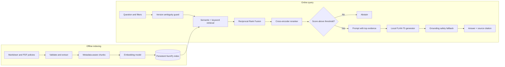

# Architecture

The system has an offline indexing path and an online question-answering path.

## Offline indexing

Markdown headings become section chunks. PDFs are validated, text is extracted
page by page, and each page is divided into overlapping windows. Every chunk keeps
its document ID, supplier, rate, effective dates, source path, and page number.

`index_documents.py` embeds those chunks with `all-MiniLM-L6-v2` and stores the
normalized vectors in `data/index/vectors.npy`. The accompanying JSON files hold
the chunk text and a manifest. A content fingerprint prevents a changed corpus
from being queried with stale vectors.

## Online question answering

The application applies supplier and rate filters before retrieval. Semantic
search captures paraphrases; keyword search preserves exact names, dates, and
rate terms. Reciprocal Rank Fusion merges their rank positions without pretending
their different score scales are directly comparable.

The top ten candidates are scored jointly with the question by
`ms-marco-MiniLM-L-6-v2`. A deterministic metadata guard asks for the policy year
when multiple versions conflict. A development-calibrated reranker cutoff rejects
unsupported questions before the generator is loaded.

For accepted questions, only the best passage is supplied to the small local
FLAN-T5 model. The output receives `[1]`, which maps to the displayed evidence.
If the model returns a very short answer or drops a numeric condition, the system
shows the retrieved policy text. This fallback addresses an observed failure in
which the model confused an 8-hour request with a 12-hour boundary.

## Operational design

Streamlit caches the index and models across questions. The generator loads only
after a question passes validation and the answerability gate. Telemetry records
latency, filters, scores, and the selected chunk while storing only a SHA-256 hash
and length for the question. JSONL logs stay local and are excluded from Git.

The NumPy vector scan is deliberate for this small corpus because its behavior is
easy to inspect. A production-scale implementation can replace that storage layer
with a vector database without changing the retrieval, reranking, or evaluation
boundaries.

